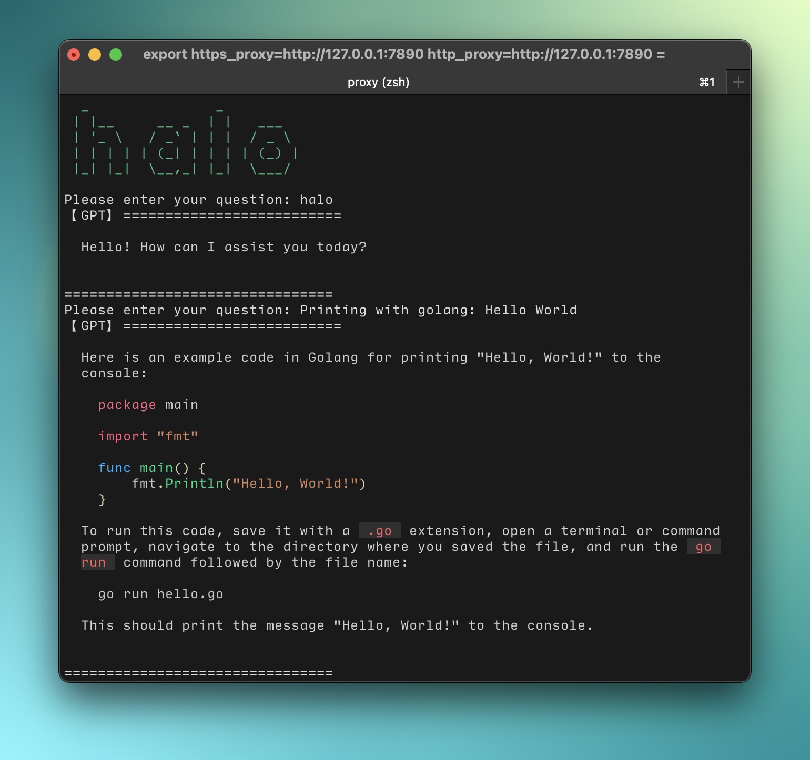

<div align="center">
  
  <p>Using GPT-3 in the terminal</p>
</div>


## Preview
<h2 align="center">
  
</h2>

## Install

```sh
go get github.com/ohxxx/tqa
```

## Usage

```
# Have a conversation
tqa

# Set API key.
tqa k OPENAI_API_KEY

# Exporting the last conversation
tqa e
```

## Conversation

After opening the dialog, use the shortcut keys to execute the program. When you have finished typing the question press <kbd>Enter</kbd> and use <kbd>Ctrl</kbd> + <kbd>D</kbd> to ask the question, use <kbd>Ctrl</kbd> + <kbd>C</kbd> to end the question.